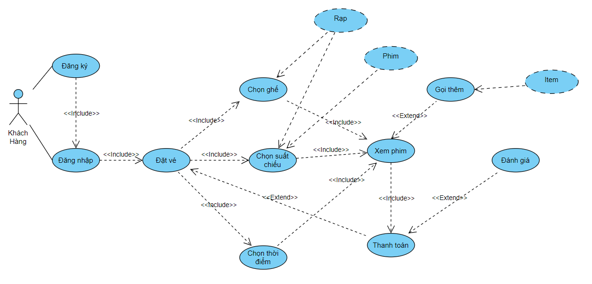
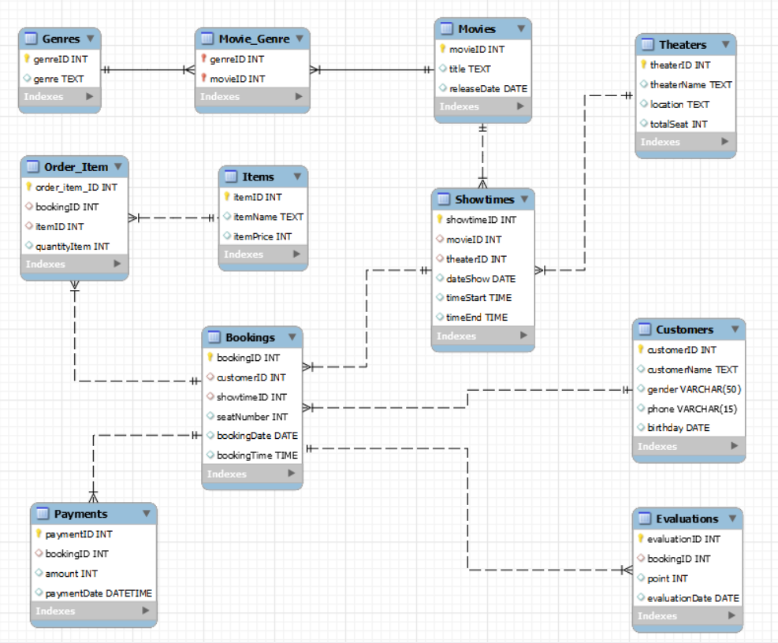

# BookingMovieManagement_Database_Design

## 1. Giới thiệu
Hệ thống đặt vé xem phim là một ứng dụng quản lý và giúp người dùng đặt chỗ hoặc mua vé để xem phim tại các rạp chiếu phim. Dưới đây là một thiết kế cơ sở dữ liệu cho hệ thống đăt vé xem phim sử dụng SQL.
## 2. Tổng quan thiết kế
- Hệ thống đặt vé xem phim bao gồm rạp phim, khách hàng, bộ phim, suất chiếu, đồ gọi thêm (đồ ăn, đồ uống), đánh giá...
Thiết kế biểu đồ Use Case qua đó khái quát được chức năng, quan hệ các thực thể trong cơ sở dữ liệu.
- Biểu đô Use-Case Diagram [usecase_diagram](Diagram/UseCaseDiagram.vpd)

- Biểu đô ER Diagram [usecase_diagram](Diagram/ER_diagram.mwb)

- Hệ thống cơ sở dữ liệu bao gồm:
1. Bảng Customers (khách hàng):
- customerID int primary key auto_increment
- customerName text
- gender varchar(50)
- phone varchar(15)
- birthday date 

2. Bảng Movies (Phim):
- movieID int primary key auto_increment,
- title text,
- releaseDate date);

3. Bảng Genres (Thể loại):
- genreID int primary key auto_increment,
- genre text);
 
4. Bảng Movie_Genre:
- genreID int 
- movieID int
- primary key (genreID, movieID)
- foreign key (genreID) references Genres(genreID)
- foreign key (movieID) references Movies(movieID) 

5. Bảng Theaters (Rạp phim):
-    theaterID INT PRIMARY KEY auto_increment,
-    theaterName text,
-    location text,
-    totalSeat int

6. Bảng Showtimes (Suất chiếu):
-    showtimeID INT PRIMARY KEY auto_increment,
-    movieID INT,
-    theaterID INT,
-    dateShow date,
-    timeStart TIME,
-    timeEnd time,
-    FOREIGN KEY (movieID) REFERENCES Movies(movieID),
-    FOREIGN KEY (theaterID) REFERENCES Theaters(theaterID)

7. Bảng Bookings (đặt vé):
-    bookingID INT PRIMARY KEY auto_increment ,
-    customerID INT,
-    showtimeID INT,
-    seatNumber INT,
-    bookingDate DATE,
-    bookingTime time,
-    FOREIGN KEY (customerID) REFERENCES Customers(customerID),
-    FOREIGN KEY (showtimeID) REFERENCES Showtimes(showtimeID)

8. Bảng Items (đồ gọi thêm):
-    itemID INT PRIMARY KEY auto_increment ,
-    itemName text,
-    itemPrice int

9. Bảng Order_Item(Gọi thêm đồ):
- order_item_ID int primary key auto_increment,
- bookingID int,
- FOREIGN KEY (bookingID) REFERENCES Bookings(bookingID),
- itemID int,
- FOREIGN KEY (itemID) REFERENCES Items(itemID),
- quantityItem int

10. Bảng Payments (Thanh toán):
-    paymentID INT PRIMARY KEY auto_increment,
-    bookingID INT unique ,
-    amount int,
-    paymentDate DATETIME,
-    FOREIGN KEY (bookingID) REFERENCES Bookings(bookingID)
  
11. Bảng Evaluations (đánh giá):
-    evaluationID INT PRIMARY KEY auto_increment,
-    bookingID INT unique ,
-    point int,
-    evaluationDate date,
-    FOREIGN KEY (bookingID) REFERENCES Bookings(bookingID)
#### Chi tiết xem thêm tại đây **[BookingMovie_database_design.XLSX](https://docs.google.com/spreadsheets/d/1tf4uSJdZvCEONUMi_B01MdSr9F-4anID/edit?usp=drive_link&ouid=108740500499233988249&rtpof=true&sd=true").**
## Kết quả
- Biết cách tạo bảng, xóa bảng
- Nắm được cơ bản các câu truy vấn cơ bản
- Khóa chính, khóa ngoại cùng với mối quan hệ giữa các thực thể trong cơ sở dữ liệu.
## Cài đặt môi trường
Cài đặt MySQL cho Windows các hệ điều hành khác tương tự.
1. Tải MySQL Installer

- Truy cập trang chính thức của MySQL để tải MySQL Installer.
- Đường dẫn tới trang tải là: **[https://dev.mysql.com/downloads/installer/](https://dev.mysql.com/downloads/installer/).**
2. Chạy MySQL Installer

- Chạy tệp tải về (thường là một tệp .exe) để mở MySQL Installer.

3. Chọn "Custom" để Tùy chọn cài đặt

- Trong cửa sổ Installer, chọn "Custom" để có các tùy chọn cài đặt chi tiết.

4. Chọn Các Thành Phần Cần Cài Đặt

- Chọn các thành phần bạn muốn cài đặt.
- Thông thường, bạn ít nhất cần cài đặt MySQL Server.
- Để bắt đầu, bạn cũng có thể cài đặt MySQL Workbench để quản lý cơ sở dữ liệu của mình.

5. Thiết Lập Cấu Hình MySQL Server

- Chọn "Standalone MySQL Server" và tiếp tục.
- Chọn cổng mà MySQL sẽ sử dụng (thường là 3306).
- Chọn "Use Strong Password Encryption" và tạo một mật khẩu cho tài khoản root.
